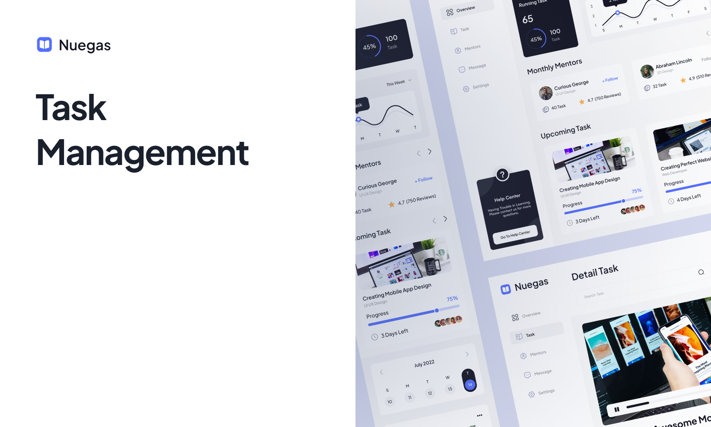

# Web Development Project: Task Management



This website is a **learning project web application** I created to test my **web tech** skills. And also for people to see my development skills and experience.

First, the project will use an already designed project I found on [Figma templates.](https://www.figma.com/community/file/1375949888965696148/task-management-dashboard)

For the development of this project, I will use [React](https://react.dev/) and [TailwindCSS.](https://tailwindcss.com) And also [parcel](https://parceljs.org/) as a module bundler.

This project is developed under an **open-source software license.** Feel free to comment or send a personal message for details or other information.

_All information presented in this project is fictitious and does not represent real (**valid**) data._

## Build instructions

To install all the software dependencies, run:

```cli
    yarn install
```

To build the project for development purposes, starting a local server, run:

```cli
    yarn parcel:dev
```

To build the project for production (minifying source codes), run:

```cli
    yarn parcel:build
```

I recommend you check the `package.json` files to see more tools, libraries and other CLI commands related to this project.
